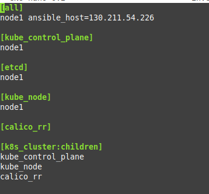
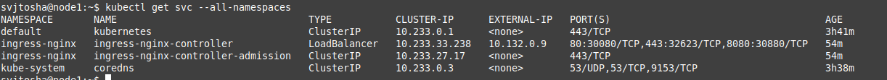
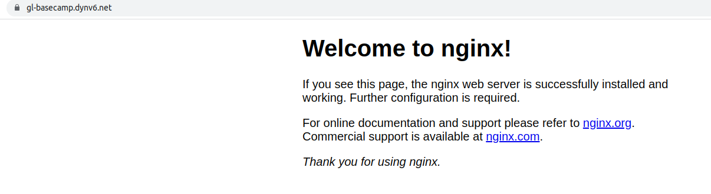

# Deploy K8s with help Kubespray and ansible playbook

On a first step I created and configured a virtual machine.

When creating the VM, I added an ssh public key to it in order to connect from my laptop without problems in the future.

After creation I checked the connection to the VM.

The connection is successful.

Next, I moved on to setting up a remote installation of Kubernetes using ansible.

I cloned Kubespray release repository to my personal laptop. I did this using the following commands.

~~~
git clone https://github.com/kubernetes-sigs/kubespray.git
cd kubespray
git checkout release-2.20
~~~

In the next step, I copied and modified the inventory file.

After that, I modified the addons.yml and k8s-cluster.yml files according to my settings and thus enabled MetalLB.

In file addons.yml:

~~~
nano inventory/mycluster/group_vars/k8s_cluster/addons.yml
~~~

Added the following strings:

~~~
metallb_enabled: true
metallb_speaker_enabled: true
metallb_avoid_buggy_ips: true
metallb_ip_range:
  - "10.132.0.9/32"
~~~

In file k8s-cluster.yml:

~~~
nano inventory/mycluster/group_vars/k8s_cluster/k8s-cluster.yml
~~~

The following setting is changed from "false" to "true".

~~~
kube_proxy_strict_arp: true
~~~

With the following command, I mounted the folder with kubespray and ssh keys to the docker container and started it.

~~~
docker run --rm -it -v /home/svjtosha/kubespray:/mnt/kubespray \
  -v /home/svjtosha/.ssh:/pem \
  quay.io/kubespray/kubespray:v2.20.0 bash
~~~

In the next step I went to kubespray folder and start ansible-playbook.

~~~
cd /mnt/kubespray

ansible-playbook -i inventory/mycluster/inventory.ini --private-key /pem/gcp_rsa -e ansible_user=svjtosha -b  cluster.yml
~~~

Ansible playbook worked successfully.

After successful installation I connected to VM and copy kubectl configuration file.

~~~
mkdir ~/.kube
sudo cp /etc/kubernetes/admin.conf ~/.kube/config
sudo chmod 777 ~/.kube/config
~~~

As result I saw:

Next, I installed the ingress controller. To do this, I created the nginx-ctl.yaml and path_provisioner.yaml files with the appropriate instructions on the virtual machine and ran them with the following commands:

~~~
kubectl apply -f nginx-ctl.yaml
kubectl apple -f path_provisioner.yml
~~~

After entering the following command, I saw that the ingress controller was working correctly and the external IP appeared on the load balancer:

~~~
kubectl get svc --all-namespaces
~~~

In the next step, I registered the ___gl-basecamp.dynv6.net___ domain at the free registrar [dynv6.com](https://dynv6.com/) and added the IP of my virtual machine in the domain settings. (For the test, I created a deployment with services that I will talk about below.)

Now my site with nginx is available on the Internet under the domain name I created, but still with an insecure connection.

I used [https://cert-manager.io/](https://cert-manager.io/) with Letsencrypt to setup the ssl certificate.

On first I used next command to install cert manager to Kubernetes cluster:

~~~
kubectl apply -f https://github.com/cert-manager/cert-manager/releases/download/v1.11.0/cert-manager.yaml
~~~

Then I prepared 2 yaml files staging_clusterIssuer.yaml to verify that the certificate is generated correctly and prod_clusterIssuer.yaml to apply the ssl certificate to our cluster.
I transferred these files to the VM and ran them with the following command:

~~~
kubectl apply -f staging_clusterIssuer.yaml
kubectl apply -f prod_clusterIssuer.yaml
~~~

After executing the following command, we can see that our clusterissuers are working.

~~~
kubectl get clusterissuers
~~~

After that, the ingress.yaml file was created and configured, where my host gl-basecamp.dynv6.net and cluster-issuer were specified. At first it was stanging, and after checking that everything works correctly, I replaced stanging with prod.

After updating the ingress file with the prod settings, a secure connection was created for my cluster.

The nginx page now works over the secure https protocol.

As it was said a little above, to perform the task I prepared a deployment with the ClusterIP service as and ingress file with connecting to ClusterIssuer and use the letsencrypt certificate. I add all these files to my repository.

In the end, I decided to slightly modify the nginx image in my deployment and add my html page to it.
Using docker on my laptop, I created a new image to which I added my page. I then uploaded this image to dockerhub. By changing the image in deployment and running the following command, I changed the look of my site.

~~~
kubectl apply -f nginx-deployment.yaml
~~~
